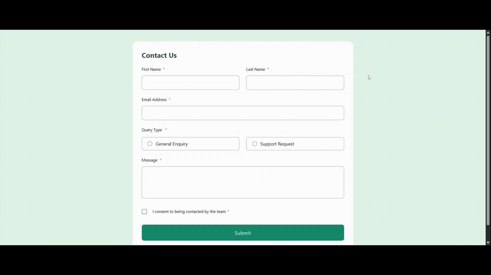

# Frontend Mentor - Contact form solution

This is a solution to the [Contact form challenge on Frontend Mentor](https://www.frontendmentor.io/challenges/contact-form--G-hYlqKJj). Frontend Mentor challenges help you improve your coding skills by building realistic projects.


<!-- add later -->
<a href="">
  
</a>

## Table of Contents

- [Overview](#overview)
  - [The Challenge](#the-challenge)
  - [Preview](#preview)
  - [Links](#links)
- [Getting Started](#getting-started)
  - [Prerequisites](#prerequisites)
  - [Installation](#installation)
  - [Usage](#usage)
- [About](#about)
  - [License](#license)
  - [Author](#author)

## Overview

### The Challenge

Users should be able to:

- Complete the form and see a success toast message upon successful submission
- Receive form validation messages if:
  - A required field has been missed
  - The email address is not formatted correctly
- Complete the form only using their keyboard
- Have inputs, error messages, and the success message announced on their screen reader
- View the optimal layout for the interface depending on their device's screen size
- See hover and focus states for all interactive elements on the page

### Preview

<!-- add later -->



### Links

<!-- add later -->

- Solution URL:
- Live Site URL:

## Getting Started

Follow these steps to set up and run the project locally.

### Prerequisites

Make sure you have the following installed:

- **Node.js** (v18 or higher)
- **npm** (v9 or higher)

### Installation

Clone this repository and install dependencies.

```bash
git clone https://github.com/YOUR-USERNAME/REPO-NAME.git
cd REPO-NAME
npm install
```

## Usage

Run the app in development mode:

```bash
npm run dev
```

Then open your browser at http://localhost:5173.

## About

### License

This project is licensed under the MIT License - see the [LICENSE](LICENSE) file for details.

### Author

- GitHub - [@Denislav-Dimov](https://github.com/Denislav-Dimov)
- Frontend Mentor - [@Denislav-Dimov](https://www.frontendmentor.io/profile/Denislav-Dimov)
